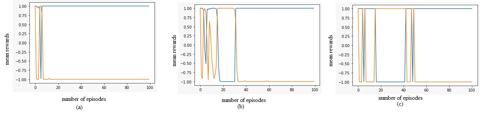
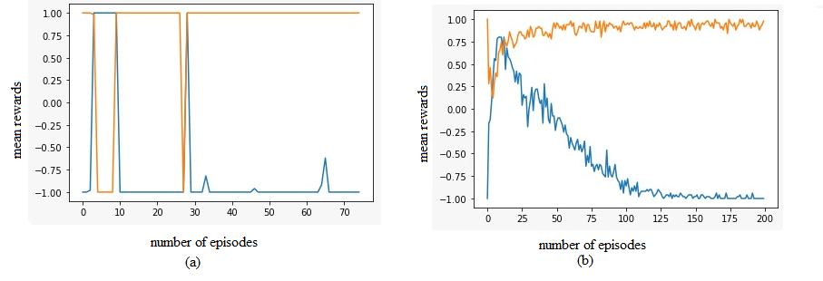

# CS698R-Project-Penalty-Shot-Striker-8

## Introduction
Learning sources by which agents can communicate with complicated environments and individuals is a crucial aim of decision neuroscience and Game theory Myerson [[2013]](#1). In most experimental standards, choices are discrete, play is static, and optimal solutions are known. 
Yet, in real environments, communications between agents typically
involve continuous action spaces, continuous dynamics, and no known optimal solution. Here, we overcome this issue by using a “penalty shot” task in which agents compete against each other in a competitive, real-time videogame. This paradigm generates a rich complexity in individuals’ behavior that can be succinctly described by individualized, instantaneous policy and value functions, facilitating analysis at multiple timescales of interest. It quantifies complex interactions between various agents in a parsimonious manner and suggests new classes of tractable paradigms for studying human behavior and decision-making. From a game-theoretic and a neuroscientific point of
view,it can give us tremendous insights into decision-making.
 
 Here we conduct a systematic evaluation of our defined problem using two experiments first is finding the optimal results with discretized action space, and the second is with continuous space. We use baselines for the model training and evaluation. We also perform experiments with multiple hyperparameters during model tuning and with dynamics of the environment, like changing the puck’s velocity, the bars length etc.

## 

## Solution Approach

The solution strategy we used is like two players learning to play badminton with zero initial experience. They start randomly, and with practice, both players improve their performance. In each trial, both players have to compete with an improved version of their competitors.

So we created two environment functions, Kickenv1 and Kickenv2. Kickenv1 takes bar policy as an argument to predict bar action given current observation, and its step function takes the action of pucker as input. For Kickenv2, it is vice versa. Then we created two models Model1 and Model2. Model1 learns to play as the pucker, and Model2 learns to play as the bar. In each episode, Model1 is trained on Kickenv1 (Model2 policy to predict the bar's action), and Model2 is trained on Kickenv2 (Model1 policy to anticipate the pucker action). For the next episode, the trained models are saved and then loaded again on new environment instances with better opponents' policies. This is how learning progresses for some episodes.

## Observation and Results

We looked at the average rewards obtained by the agents for different velocity profiles, and we noticed that the bar always won for low velocities. For high velocities, the puck always won. We used baselines for the model training and evaluation. After evaluating the approaches, we found that the experimental results for continuous action space settings are better than the discrete ones. Discrete action space setting experiments showed that the policies used a lot of time to evaluate and did not perform well. In contrast, the continuous action space setting converged very fast. We also performed experiments with multiple hyperparameters during model tuning and with environment dynamics, like changing the puck's velocity, the bar's length, etc. Below figures show the experimental results for two different settings of velocity with various algorithms.

<!--  -->

<!-- 

  
  

 -->

| A2C, no. timesteps = 1000, no. episodes = 100, (b) PPO, no. timesteps = 1000, no. episodes = 100, and (c) DDPG, no. timesteps = 1000, no. episodes = 100")|
|:--:|
|*Experimental results for various algorithm with velocity 0.3 mean rewards vs number of episodes (a) A2C, no. timesteps = 1000, no. episodes = 100, (b) PPO, no. timesteps = 1000, no. episodes = 100, and (c) DDPG, no. timesteps = 1000, no. episodes = 100*|

| A2C, no. timesteps = 1000, no. episodes = 70, (b) PPO, no. timesteps = 1000, no. episodes = 200")|
|:--:|
|*Experimental results for various algorithm with velocity 0.01 mean rewards vs number of episodes (a) A2C, no. timesteps = 1000, no. episodes = 70, (b) PPO, no. timesteps = 1000, no. episodes = 200*|

## How to run?

Download the DDPG, PPO and A2C notebooks and then you can run them directly on your system or on Google colab.

## References

<a id="1">[1]</a> 
Roger B Myerson. 
Game theory. 
Harvard university press, 2013
http://www.ru.ac.bd/stat/wp-content/uploads/sites/25/2019/03/405_06_Myerson_Game-Theory_-Analysis-of-Conflict-Harvard-University-Press-1997.pdf

